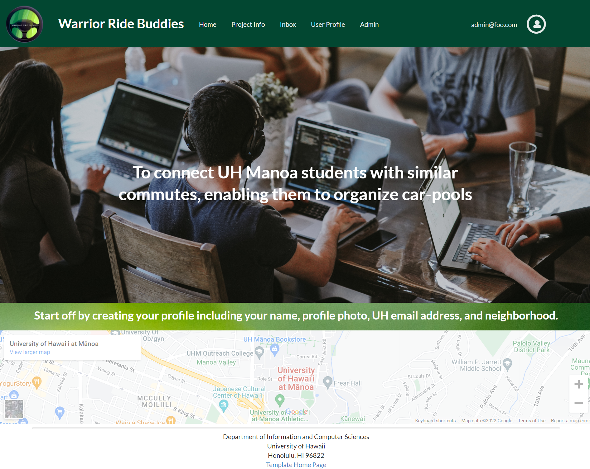

# Warrior Ride Buddies
## Table of contents

* [Overview](#overview)
* [User Guide](#user-guide)
* [Community Feedback](#community-feedback)
* [Developer Guide](#developer-guide)
* [Contact Us](#contact-us)

## Overview
The goal of Warrior Ride Buddies is to connect UH Manoa students with similar commutes, enabling them to organize car-pools. 
This application will help students save money on gas and parking.

## User Guide
- Start off by creating your profile including your name, profile photo, UH email address, and neighborhood.
- Categorize yourself as a driver, rider, or both if you’re willing.
- Drivers must include the following information about their car: year, make/model, and license plate.
- Rider’s will have a recommended gas-money contribution for their drivers depending on their distance from campus.
- Adjust your desired arrival times for each day of the week.
- Once your profile is completed, it will be visible on the app’s home page, which is a map populated with other commuters shown in their general starting locations. Users can interact with the map by clicking on other’s profiles and filtering them by various categories.
- Coordinate with other users that have similar commutes by clicking their profile and using our in-app messaging system.

### Screenshots of mockups

## Community Feedback
Provides information obtained from users about the system.

## Developer Guide
How to download, install, and run the system locally, as well as how to deploy it.

## Development history
Explains the trajectory of development of the system: what was accomplished during each milestone. See the BowFolios system for details.

## Contact Us
Here are the developers of this application. If you want to get in contact with them, here are their professional portfolios:
* [Kobey Arai](https://kobeyarai808.github.io/)
* [Alyssia Chen](https://alyssia-chen.github.io/)
* [William Liang](https://william-liang808.github.io/)
* [Yong-Sung Masuda](https://yongsungm.github.io/)
* [Scott Yuk](https://scott-yuk.github.io/)
