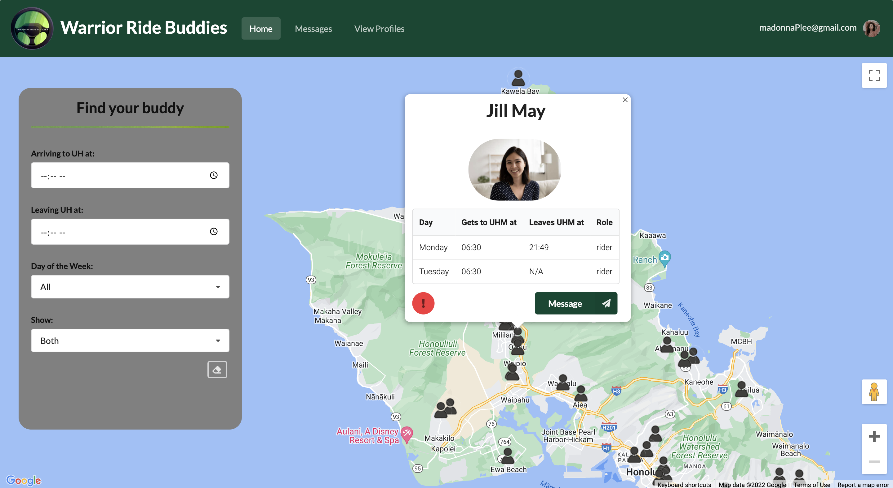
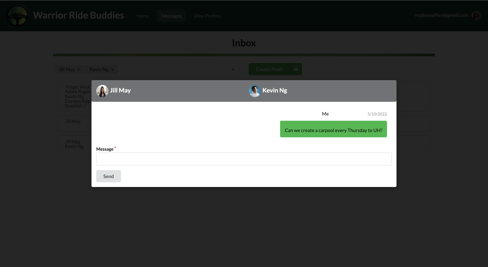
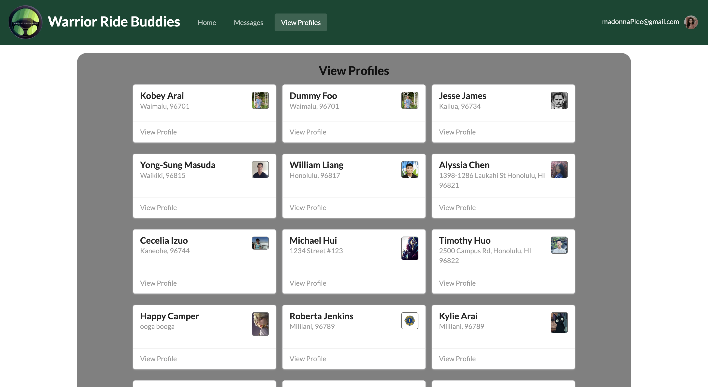

# Warrior Ride Buddies

## Table of contents

* [Overview](#overview)
* [User Guide](#user-guide)
* [Development History](#development-history)
* [Contact Us](#contact-us)

## Overview
The goal of Warrior Ride Buddies is to connect UH Manoa students with similar commutes, enabling them to organize car-pools. 
This application will help students save money on gas and parking.

Here is the link to our [organization](https://github.com/warrior-ride-buddies) and the [team contract](https://docs.google.com/document/d/1JwVIlZwdnLveOPWr_WfwH-5iD-kGBiF5fv1-mwz5sEc/edit?usp=sharing) we created at the beginning of this project.

## User Guide
- Start off by creating your profile including your name, profile photo, UH email address, and neighborhood.
- Categorize yourself as a driver, rider, or both if you’re willing.
- Drivers must include the following information about their car: year, make/model, and license plate.
- Riders will have a recommended gas-money contribution for their drivers depending on their distance from campus.
- Adjust your desired arrival times for each day of the week.
- Once your profile is completed, it will be visible on the app’s home page, which is a map populated with other commuters shown in their general starting locations. Users can interact with the map by clicking on other’s profiles and filtering them by various categories.
- Coordinate with other users that have similar commutes by clicking their profile and using our in-app messaging system.

### Deployment
Here is our [deployed app](http://188.166.83.198/#/).

### Screenshots of Mockups

</img>
On the landing page, the user can gain more insight about how the application works.

Using the filters on the left, users can search for other users (driver/riders) that are suitable for their schedule. Specifically, users can filter by time, day of the week, and driver/rider. Additionally, they can clear the filter by clicking on the bottom right erase icon.

Clicking on users will reveal a modal that gives more information about the user. Eventually, users will be able to click on a button to message this user to carpool.

Once riders or drivers discover people that they can carpool with, they can message people through the application. This page keeps track of users this user has messaged. 

After clicking on a user on the inbox page, past messages are displayed on a modal.

Every user has a profile page that contains information about themselves that are pertinent to the application (i.e. Name, location, car information, and up-to-date schedule)

If needed, users can edit information about themselves through this form.

This page allows users to view all of the profiles available in the application.

If anyone is reported, the report is displayed here for admin users to review and take action.

## Development History
### Milestone #1:
[M1 project page](https://github.com/warrior-ride-buddies/warrior-ride-buddies/projects/1)

For this milestone, our teammates dedicated around a week and half. In this time we:
* Brainstormed what we wanted this application to do.
* Created mockup pages of what the application should look like and what functionality the application will have.
* Created issues and came up with future "quality of life" updates to be done to the application in the future.
* Divided the issues up so that each member has at least 2 issues.

### Milestone #2:
[M2 project page](https://github.com/warrior-ride-buddies/warrior-ride-buddies/projects/2)

For this milestone, our teammates dedicated around a week and half. In this time we:
* Allowed users to create and edit accounts that are usable in the application
  * Location and time per day can be specified per person
  * Car information can be recorded
* Allowed users to filter pins on the main page to find riders or drivers suitable for their schedule
* Gave users the ability to message other users through the application

### Milestone #3:
[M2 project page](https://github.com/warrior-ride-buddies/warrior-ride-buddies/projects/3)

## Contact Us
Here are the developers of this application. If you want to get in contact with them, here are their professional portfolios:
* [Kobey Arai](https://kobeyarai808.github.io/)
* [Alyssia Chen](https://alyssia-chen.github.io/)
* [William Liang](https://william-liang808.github.io/)
* [Yong-Sung Masuda](https://yongsungm.github.io/)
* [Scott Yuk](https://scott-yuk.github.io/)

Here is our [team contract](https://docs.google.com/document/d/1JwVIlZwdnLveOPWr_WfwH-5iD-kGBiF5fv1-mwz5sEc/edit?usp=sharing)

## Future ideas to implement
* Deal with Unsolicited Interactions (Blocking, etc.)
* Allow group chats
* Convert Web app to React Native
* Provided a recommended tip/gratuity
* Allow users to go from UH to Home
