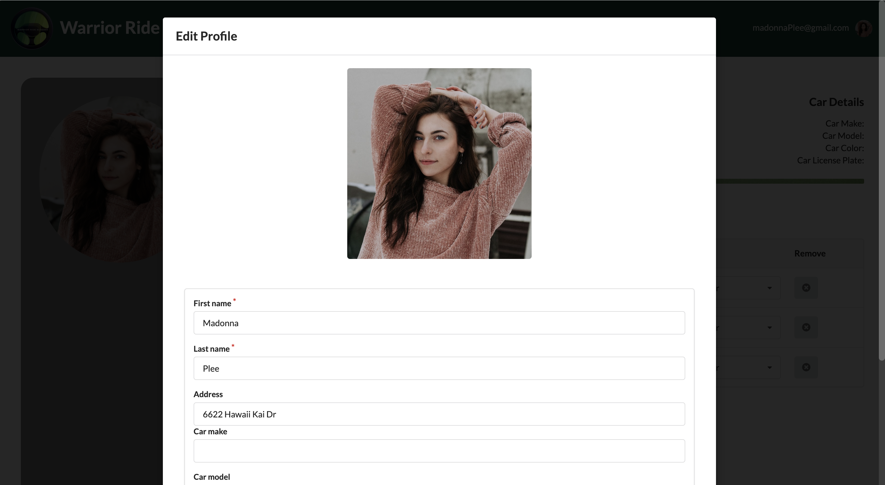
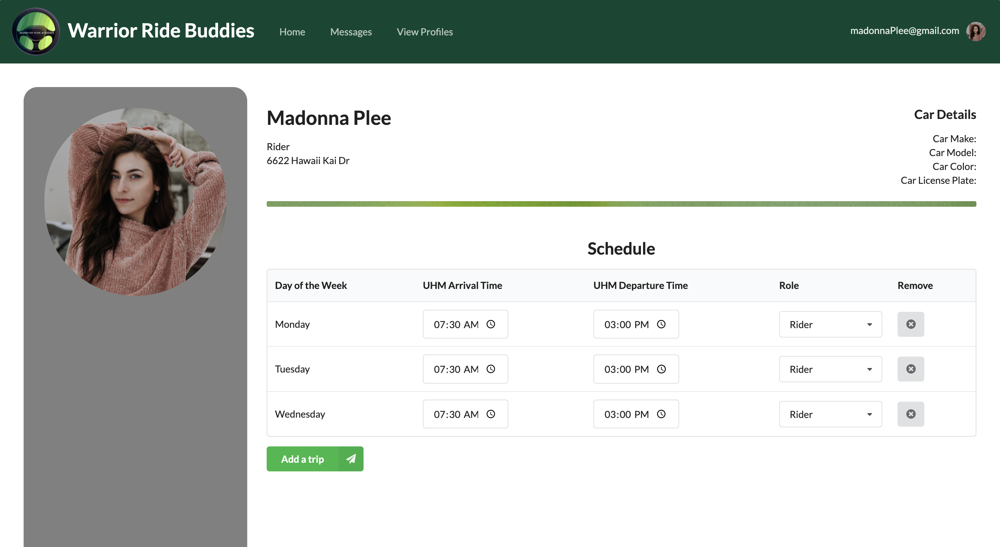
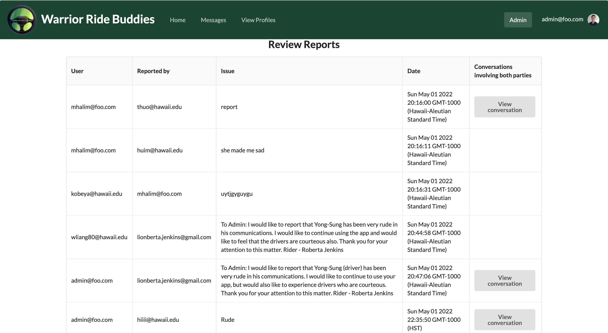

# Warrior Ride Buddies
## Table of contents

* [Overview](#overview)
* [User Guide](#user-guide)
* [Development History](#development-history)
* [Contact Us](#contact-us)

## Overview
The goal of Warrior Ride Buddies is to connect UH Manoa students with similar commutes, enabling them to organize car-pools. 
This application will help students save money on gas and parking.

## User Guide
- Start off by creating your profile including your name, profile photo, UH email address, and neighborhood.
- Categorize yourself as a driver, rider, or both if you’re willing.
- Drivers must include the following information about their car: year, make/model, and license plate.
- Riders will have a recommended gas-money contribution for their drivers depending on their distance from campus.
- Adjust your desired arrival times for each day of the week.
- Once your profile is completed, it will be visible on the app’s home page, which is a map populated with other commuters shown in their general starting locations. Users can interact with the map by clicking on other’s profiles and filtering them by various categories.
- Coordinate with other users that have similar commutes by clicking their profile and using our in-app messaging system.

### Screenshots of Mockups

## Development History
### Milestone #1:
For this milestone, our teammates dedicated around a week and half. In this time we:
* Brainstormed what we wanted this application to do.
* Created mockup pages of what the application should look like and what functionality the application will have.
* Created issues and came up with future "quality of life" updates to be done to the application in the future.
* Divided the issues up so that each member has at least 2 issues.

## Contact Us
Here are the developers of this application. If you want to get in contact with them, here are their professional portfolios:
* [Kobey Arai](https://kobeyarai808.github.io/)
* [Alyssia Chen](https://alyssia-chen.github.io/)
* [William Liang](https://william-liang808.github.io/)
* [Yong-Sung Masuda](https://yongsungm.github.io/)
* [Scott Yuk](https://scott-yuk.github.io/)

## Future ideas to implement
* Deal with Unsolicited Interactions (Blocking, etc.)
* Allow group chats
* Convert Web app to React Native
* Provided a recommended tip/gratuity
* Allow users to go from UH to Home